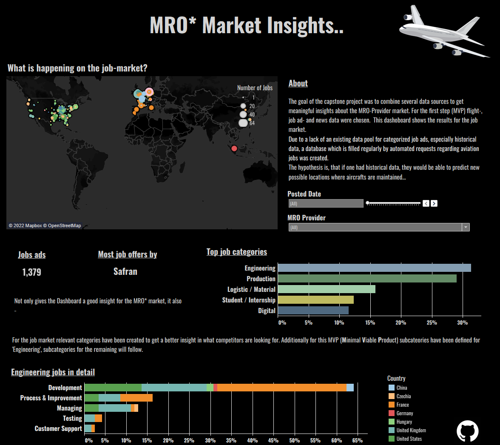
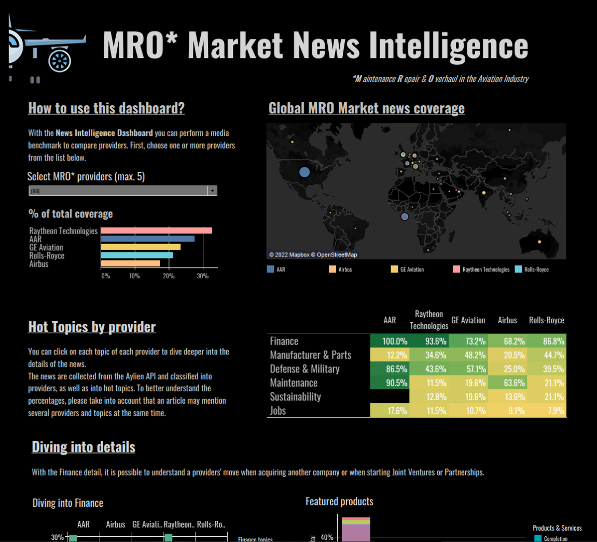

# Automated Market Intelligence Dashboard

This project is an automated approach to improve Buisness Intelligence from MRO Providers (Maintenance Repair & Overhaul in the aviation industry) by combining data from several sources. Up-to-date market-insights are essential to understand customer requirements  and by using flight data, job ads, and news, our dashboards provide these insights.

   

## Data Sources
- The **job data** is retrieved from the LinkedIn API in RapidAPI. Click [here](https://rapidapi.com/jaypat87/api/linkedin-jobs-search/) for more information.  
- The **news data** is retrieved from the Aylien API. For more information consult the [documentation](https://docs.aylien.com/newsapi/interactive-documentation/) and get a 14 days free trial. The Aylien API has a Jupyter Notebook guide for Python users, you can dowload it [here](https://learn.aylien.com/news_api_python_starter_guide.html).
- The **flight data** for incidents and accidents is retrieved from the [Aviation Herald](https://avherald.com/).
